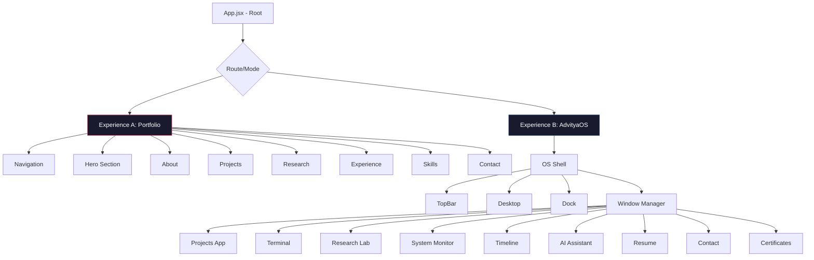

# Portfolio Redesign — Complete Rebuild

## Problem

The current portfolio at [App.jsx](file:///Volumes/Data/Projects/portfolio/src/App.jsx) is a macOS desktop simulation that:
- Forces boot sequence before any content is visible
- Shows a [MobileWarning](file:///Volumes/Data/Projects/portfolio/src/components/system/MobileWarning.jsx) that completely blocks mobile users
- Hides all information behind double-click interactions
- Has a Terminal placeholder ("Coming Soon") in the [Dock](file:///Volumes/Data/Projects/portfolio/src/components/dock/Dock.jsx)
- Requires exploration to discover who you are

The redesign creates a **dual-experience architecture**: a professional, mobile-first portfolio (Experience A) that works for everyone, plus an optional interactive OS (Experience B) for developers who want to explore.

---

## User Review Required

> [!IMPORTANT]
> **Tech stack change**: Your requirements specify **Next.js + TypeScript**, but your current project uses **Vite + React + JavaScript**. This plan proposes a **complete rewrite** — we will delete the existing `src/` contents and rebuild from scratch using the same **Vite + React + JavaScript** stack (keeping what works) but with an entirely new architecture. Migrating to Next.js + TypeScript would add significant scope to Phase 1.

> [!IMPORTANT]
> **Staying with Vite + React + JSX**: Since Phase 1 is about structure and design with placeholder content, and we're already set up with Vite + React + Tailwind v4 + Framer Motion + shadcn/ui, I recommend we keep this stack for now and optionally migrate to Next.js + TypeScript in a later phase. This lets us focus on what matters: the design and experience.

> [!WARNING]
> **Scope control**: This is a massive project. Even as Phase 1 (structure + design, placeholder data), it involves ~50+ new components. I've structured the plan to build incrementally so you can review progress at checkpoints.

## Open Questions

> [!IMPORTANT]
> **Color palette preference**: The plan uses a monochromatic dark palette with a single accent color (electric blue/violet). Do you prefer:
> - Monochrome + single accent (Linear/Vercel feel)
> - Warm neutrals with a gradient accent (Arc Browser feel)
> - High-contrast black/white with neon accents (Nothing feel)

> [!IMPORTANT]
> **AI Assistant**: You mentioned an integrated AI assistant that answers from portfolio data. For Phase 1, should this be:
> - A static lookup system (pattern-matching on keywords → pre-written answers)
> - A placeholder UI with simulated responses
> - Deferred to Phase 2 (with an actual LLM integration)

---

## Architecture Overview



---

## New Folder Structure

```
src/
├── App.jsx                          # Root with mode switching
├── main.jsx                         # Entry point
├── index.css                        # Design tokens + global styles
│
├── data/                            # Centralized placeholder data
│   ├── projects.js
│   ├── experience.js
│   ├── skills.js
│   ├── research.js
│   └── personal.js
│
├── hooks/                           # Shared hooks
│   ├── useMediaQuery.js
│   ├── useScrollSpy.js
│   ├── useReducedMotion.js
│   └── useTheme.js
│
├── lib/
│   └── utils.js                     # Utilities (cn, etc.)
│
├── store/
│   ├── systemStore.js               # AdvityaOS window management
│   ├── themeStore.js                 # Theme (dark/light) state
│   └── portfolioStore.js            # Portfolio mode state
│
├── components/
│   ├── ui/                          # shadcn/ui primitives
│   │
│   ├── shared/                      # Shared across both experiences
│   │   ├── AnimatedText.jsx
│   │   ├── GlassCard.jsx
│   │   ├── SectionHeading.jsx
│   │   ├── TechBadge.jsx
│   │   ├── AnimatedCounter.jsx
│   │   ├── MagneticButton.jsx
│   │   ├── ParallaxWrapper.jsx
│   │   └── ScrollReveal.jsx
│   │
│   ├── portfolio/                   # Experience A components
│   │   ├── Navigation.jsx
│   │   ├── Hero.jsx
│   │   ├── About.jsx
│   │   ├── ProjectsSection.jsx
│   │   ├── ProjectCard.jsx
│   │   ├── ResearchSection.jsx
│   │   ├── ExperienceSection.jsx
│   │   ├── SkillsSection.jsx
│   │   ├── ContactSection.jsx
│   │   ├── Footer.jsx
│   │   └── PortfolioLayout.jsx
│   │
│   └── os/                          # Experience B components
│       ├── shell/
│       │   ├── TopBar.jsx
│       │   ├── ControlCenter.jsx
│       │   ├── Desktop.jsx
│       │   ├── DesktopIcon.jsx
│       │   └── ContextMenu.jsx
│       │
│       ├── dock/
│       │   ├── Dock.jsx
│       │   └── DockItem.jsx
│       │
│       ├── window/
│       │   ├── WindowFrame.jsx
│       │   └── WindowManager.jsx
│       │
│       ├── apps/
│       │   ├── ProjectsApp.jsx
│       │   ├── Terminal.jsx
│       │   ├── ResearchLab.jsx
│       │   ├── SystemMonitor.jsx
│       │   ├── Timeline.jsx
│       │   ├── AIAssistant.jsx
│       │   ├── ResumeApp.jsx
│       │   ├── ContactApp.jsx
│       │   └── CertificatesApp.jsx
│       │
│       ├── BootSequence.jsx
│       └── OSLayout.jsx
```

---

## Proposed Changes

### 1. Design System & Foundation

#### [MODIFY] [index.css](file:///Volumes/Data/Projects/portfolio/src/index.css)
Complete rewrite of the design system:
- **Dark-first color palette** using CSS custom properties with OKLCH
- Custom design tokens: spacing scale, type scale (using `clamp()` for fluid typography), animation timing curves, glass morphism presets, gradient definitions
- Add `@import` for Inter font from Google Fonts
- Custom utility classes: `.glass`, `.glass-dark`, `.text-gradient`, `.animate-float`, `.animate-glow`
- Scroll-driven animation utilities
- Custom scrollbar styles
- Selection color
- Focus-visible styles for accessibility

#### [MODIFY] [index.html](file:///Volumes/Data/Projects/portfolio/index.html)
- Add Inter font preload
- Update meta tags (title, description, Open Graph)
- Add theme-color meta tag
- Add viewport meta for mobile

---

### 2. Data Layer

All placeholder data centralized so both experiences share the same source of truth.

#### [NEW] `src/data/projects.js`
6 realistic placeholder projects with: id, title, description, longDescription, stack, category, links, featured flag, image placeholder, year.

#### [NEW] `src/data/experience.js`
3 positions with: company, role, period, description, highlights, technologies.

#### [NEW] `src/data/skills.js`
Categorized skills: Frontend, Backend, Infrastructure, Tools, Languages — each with name, level, icon reference.

#### [NEW] `src/data/research.js`
3 research papers with: title, abstract, publication, year, tags, link.

#### [NEW] `src/data/personal.js`
Name, title, bio, social links, stats (projects count, years experience, etc.), resume link.

---

### 3. Hooks & Utilities

#### [NEW] `src/hooks/useMediaQuery.js`
Reactive media query hook for responsive behavior.

#### [NEW] `src/hooks/useScrollSpy.js`
Tracks which portfolio section is in viewport for active nav state.

#### [NEW] `src/hooks/useReducedMotion.js`
Respects `prefers-reduced-motion` system preference.

#### [NEW] `src/hooks/useTheme.js`
Dark/light mode toggle with localStorage persistence.

#### [NEW] `src/store/themeStore.js`
Zustand store for theme state (dark/light), persisted.

---

### 4. Shared Components

#### [NEW] `src/components/shared/ScrollReveal.jsx`
Framer Motion wrapper that fades/slides children in on scroll intersection.

#### [NEW] `src/components/shared/GlassCard.jsx`
Reusable glass-morphism card with configurable blur, opacity, border.

#### [NEW] `src/components/shared/SectionHeading.jsx`
Section title with eyebrow text, animated gradient underline, and description.

#### [NEW] `src/components/shared/TechBadge.jsx`
Small pill badge for technology tags with subtle hover glow.

#### [NEW] `src/components/shared/AnimatedCounter.jsx`
Count-up animation for stats (e.g., "15+ Projects").

#### [NEW] `src/components/shared/MagneticButton.jsx`
Button that subtly follows cursor on hover (magnetic effect).

#### [NEW] `src/components/shared/AnimatedText.jsx`
Text that animates in letter-by-letter or word-by-word.

#### [NEW] `src/components/shared/ParallaxWrapper.jsx`
Scroll-linked parallax effect wrapper.

---

### 5. Experience A — Portfolio

#### [NEW] `src/components/portfolio/PortfolioLayout.jsx`
Main layout shell: renders Navigation, all sections in order, Footer. Smooth scroll behavior. Handles scroll spy.

#### [NEW] `src/components/portfolio/Navigation.jsx`
- Sticky top navigation with glass effect
- Logo/name on left
- Section links (smooth scroll anchors): Home, Projects, Research, Experience, Skills, Contact
- "Launch AdvityaOS" button (desktop only, hidden on mobile) with a subtle rocket/terminal icon
- Theme toggle (sun/moon)
- Mobile hamburger menu with full-screen overlay
- Active section indicator via scroll spy
- Hides on scroll down, shows on scroll up

#### [NEW] `src/components/portfolio/Hero.jsx`
- Full viewport height
- Large animated name with `AnimatedText`
- Title/role with gradient text
- One-line description
- Three CTA buttons: "View My Work" (scroll to projects), "Launch AdvityaOS" (desktop only), "Download Resume"
- Subtle animated background (mesh gradient or floating geometric shapes)
- Scroll indicator (animated chevron bouncing)
- Stats row: "X+ Projects", "X Years", "X Technologies"

#### [NEW] `src/components/portfolio/About.jsx`
- Two-column layout (image placeholder + text) on desktop, stacked on mobile
- Brief professional bio
- What I do / what drives me
- Subtle floating avatar area
- ScrollReveal animations

#### [NEW] `src/components/portfolio/ProjectsSection.jsx`
- Section heading with "Featured Projects" eyebrow
- Filter tabs: All, Frontend, Backend, Full Stack, Research
- Grid of `ProjectCard` components (2 cols desktop, 1 col mobile)
- "View All Projects" link

#### [NEW] `src/components/portfolio/ProjectCard.jsx`
- Large card with image area (gradient placeholder), title, description, tech badges
- Hover: subtle lift + glow effect + reveal arrow
- Click: could expand or navigate (for Phase 1, just hover state)
- GitHub + Live Demo links

#### [NEW] `src/components/portfolio/ResearchSection.jsx`
- Cards for each research paper
- Title, abstract snippet, publication venue, year
- Tags
- Hover reveals "Read Paper" link
- Academic but modern aesthetic

#### [NEW] `src/components/portfolio/ExperienceSection.jsx`
- Vertical timeline layout
- Each entry: role, company, period, description bullets
- Alternating sides on desktop, left-aligned on mobile
- Animated connection line
- Technology pills per role

#### [NEW] `src/components/portfolio/SkillsSection.jsx`
- Categorized skill grid
- Each category in a GlassCard
- Skill items with subtle icon + name
- No progress bars (avoids the "90% JavaScript" problem — just categorized lists)
- Categories: Languages, Frontend, Backend, Cloud & DevOps, Tools, AI/ML

#### [NEW] `src/components/portfolio/ContactSection.jsx`
- "Let's Connect" heading
- Email CTA (large, prominent)
- Social links row (GitHub, LinkedIn, Twitter/X)
- Optional: simple contact form (name, email, message) — for Phase 1, just the links
- Subtle animated gradient background

#### [NEW] `src/components/portfolio/Footer.jsx`
- Minimal footer
- "Designed & Built by Advitya Dua"
- Year
- Social icons
- "Launch AdvityaOS" Easter egg link

---

### 6. Experience B — AdvityaOS (Rebuilt)

#### [MODIFY] `src/store/systemStore.js`
Enhanced window management:
- Window snap zones (left half, right half, quadrants)
- Window animation states (opening, closing, minimizing)
- Desktop wallpaper state
- Dock visibility state
- Spring physics configuration

#### [NEW] `src/components/os/OSLayout.jsx`
Full OS shell: TopBar + Desktop + WindowManager + Dock. Manages the OS environment. Has an "Exit to Portfolio" button in the TopBar.

#### [NEW] `src/components/os/BootSequence.jsx`
Refined boot sequence (kept from existing but improved):
- No "press E" requirement — starts automatically on transition
- Faster (3 seconds max)
- Smoother typography
- Progress bar with spring physics

#### [MODIFY → MOVE] Shell components
Move existing `system/TopBar.jsx`, `system/ControlCenter.jsx`, `desktop/Desktop.jsx`, `desktop/DesktopIcon.jsx`, `desktop/ContextMenu.jsx` to `os/shell/` with improvements:
- Renamed apps in the dock/desktop
- Better glassmorphism
- Responsive to OS viewport

#### [MODIFY → MOVE] Window system
Move `window/WindowFrame.jsx` and `window/WindowManager.jsx` to `os/window/` with improvements:
- Spring-based open/close animations
- Snap zones
- Better maximize behavior (full minus topbar/dock)
- Shadow depth based on z-index

#### [MODIFY → MOVE] Dock
Move `dock/Dock.jsx` and `dock/DockItem.jsx` to `os/dock/` with improvements:
- Separator between pinned and open apps
- Bounce animation on app launch
- Better magnification curve

---

### 7. AdvityaOS Applications

#### [NEW] `src/components/os/apps/ProjectsApp.jsx`
Finder-like file browser for projects:
- Sidebar with folders (by category)
- Grid view / List view toggle
- Preview pane on the right
- Project details: description, tech stack, links
- Search bar with filtering
- Smooth transitions between views

#### [NEW] `src/components/os/apps/Terminal.jsx`
Fully interactive terminal:
- Commands: `help`, `about`, `projects`, `experience`, `skills`, `research`, `resume`, `contact`, `github`, `linkedin`, `clear`, `whoami`, `ls`, `cat`, `pwd`, `history`, `theme`, `easteregg`
- Command history (up/down arrows)
- Tab completion
- Typed output animation
- Color-coded output
- Easter eggs: `sudo rm -rf /`, matrix rain, `cowsay`
- Welcome message on open

#### [NEW] `src/components/os/apps/ResearchLab.jsx`
Research papers viewer:
- List of papers with abstracts
- Click to expand full details
- Tags and filtering
- Publication venue and year
- Clean, academic-styled reading pane

#### [NEW] `src/components/os/apps/SystemMonitor.jsx`
Portfolio stats dashboard (replaces fake CPU):
- Projects completed (animated counter)
- Research papers published
- GitHub commits (placeholder number)
- Years coding
- Technologies known
- Cloud deployments
- Languages spoken
- Animated circular progress indicators
- Real-time-feeling counters

#### [NEW] `src/components/os/apps/Timeline.jsx`
Career timeline:
- Vertical scrollable timeline
- Color-coded entries: Projects (blue), Research (green), Certifications (gold), Career (purple)
- GitHub-contribution-style heatmap (simplified)
- Year markers
- Expandable entries

#### [NEW] `src/components/os/apps/AIAssistant.jsx`
Chat-style AI assistant:
- Chat interface with message bubbles
- Pre-programmed responses based on keyword matching
- Suggested questions as chips
- Typing indicator animation
- Answers sourced from `src/data/` files
- "Ask me anything about Advitya" prompt

#### [NEW] `src/components/os/apps/ResumeApp.jsx`
Improved version of existing Resume component:
- Clean, printable-style layout
- Download button
- Dark/light toggle within the app

#### [NEW] `src/components/os/apps/ContactApp.jsx`
Contact form + social links in an OS window.

#### [NEW] `src/components/os/apps/CertificatesApp.jsx`
Grid of certificates/achievements with placeholder cards.

---

### 8. Root App & Mode Switching

#### [MODIFY] [App.jsx](file:///Volumes/Data/Projects/portfolio/src/App.jsx)
Complete rewrite:
- State: `mode` — `'portfolio'` (default) or `'os'`
- Renders `PortfolioLayout` or `OSLayout` based on mode
- Animated transition between modes (fade + scale)
- `ThemeProvider` wrapper
- Mobile detection: if mobile, always render portfolio mode (hide AdvityaOS button)

---

## Build Order (Incremental Checkpoints)

### Checkpoint 1: Foundation
- Design tokens (CSS)
- Data files
- Hooks
- Shared components
- Theme system

### Checkpoint 2: Portfolio (Experience A)
- Navigation
- Hero
- About
- Projects section
- Research section
- Experience section
- Skills section
- Contact section
- Footer
- Full responsive layout

### Checkpoint 3: OS Shell (Experience B)
- Boot sequence
- TopBar + Desktop + Dock
- Window manager
- Mode switching from portfolio

### Checkpoint 4: OS Applications
- Terminal (fully interactive)
- Projects App (Finder-style)
- Research Lab
- System Monitor
- Timeline
- AI Assistant
- Resume / Contact / Certificates

### Checkpoint 5: Polish
- All animations
- Accessibility audit
- Performance optimization
- Light mode refinement
- Final responsive testing

---

## Verification Plan

### Automated Tests
- `npm run build` — Verify production build succeeds with no errors
- `npm run lint` — No linting errors

### Manual Verification
- `npm run dev` — Launch dev server
- Test all portfolio sections scroll and render correctly
- Test navigation active state tracking
- Test AdvityaOS launch from portfolio
- Test all OS applications open and function
- Test terminal with all documented commands
- Test responsive: resize browser to mobile (375px), tablet (768px), desktop (1440px)
- Test dark/light mode toggle
- Test keyboard navigation through portfolio sections
- Test "Exit to Portfolio" from AdvityaOS
- Verify no "Coming Soon" placeholders exist
